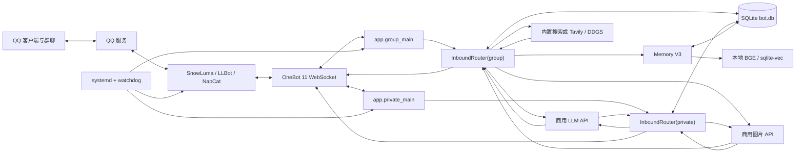
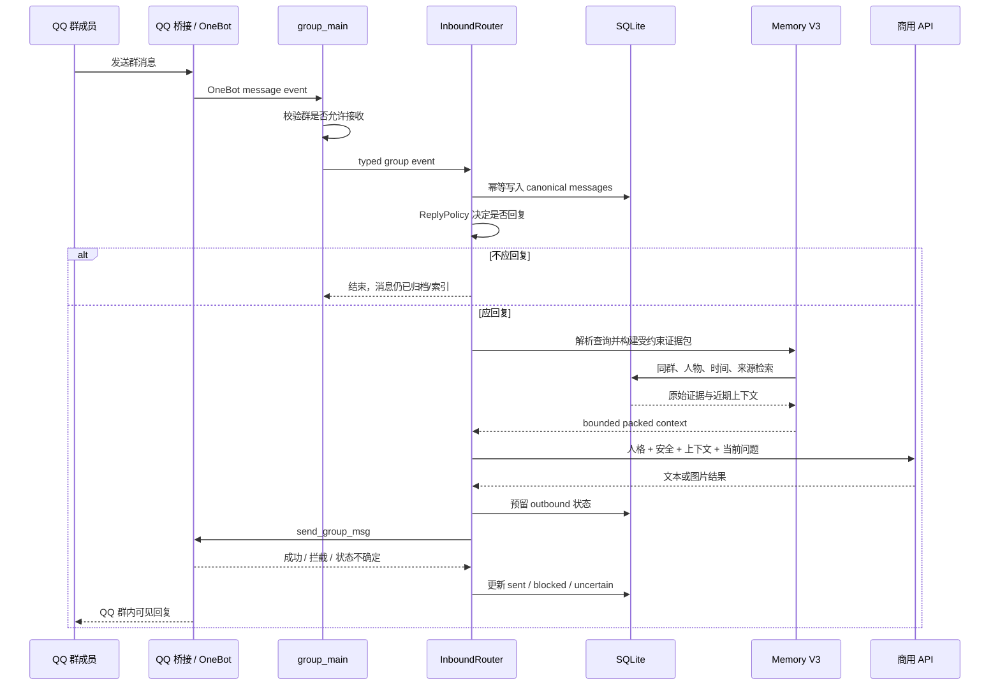
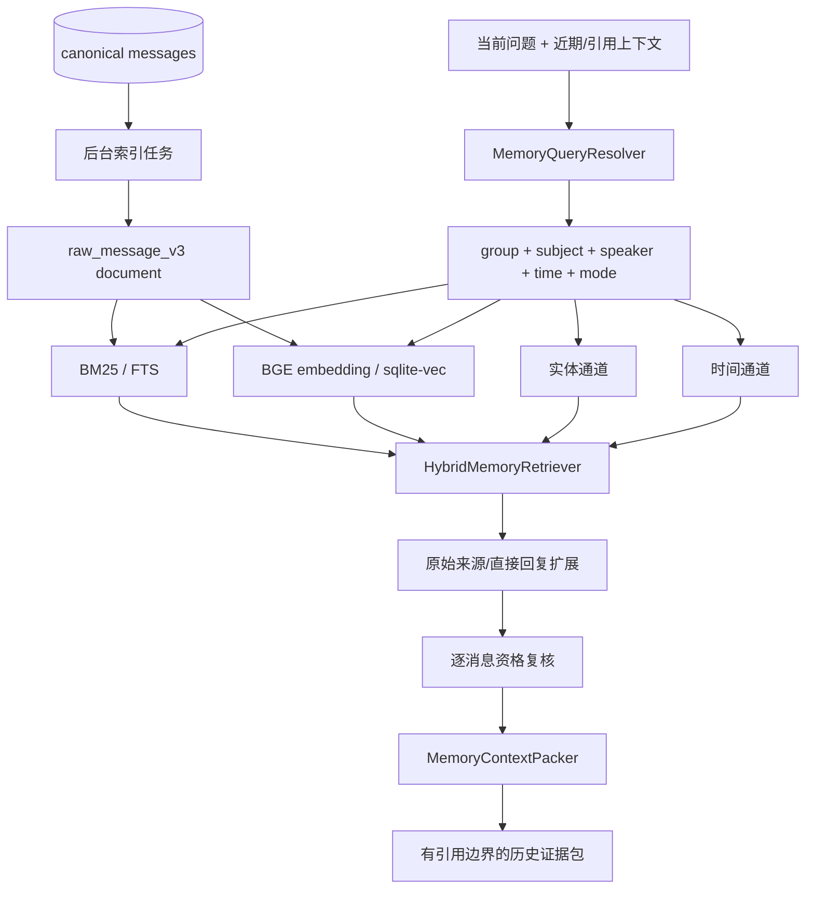

# 小町 QQ AI Bot 工程设计与运行原理

本文面向维护者、部署者和希望理解完整实现的开发者，说明小町如何连接 QQ、组织群聊上下文、调用商用模型与搜索/生图服务、持久化数据，以及 Memory V3 如何从原始消息中检索可核验的历史证据。

日常安装、启动和命令清单见 [WSL/Docker 运维手册](../infra/wsl/README.md)；本文重点解释系统为什么这样组成、数据如何流动，以及各模块的职责边界。

## 1. 系统定位

小町是一个运行在 WSL2 + Docker 上的 Python 3.12 QQ 群聊机器人。它不直接实现 QQ 协议：示例配置使用 SnowLuma，另可切换 LLBot 或 NapCat；三种平台都通过 OneBot 11 WebSocket 收发事件和调用 QQ 动作。

系统的主要能力包括：

- 群消息接收、归档、回复决策、主动插话和引用回复；
- 基于人格、安全规则、群配置和上下文的文本回复；
- OpenAI 兼容的 Responses 或 Chat Completions 模型调用；
- 模型内置联网搜索，或 Tavily/DDGS 外部搜索；
- 独立商用图片 API 的文生图、参考图生图和队列控制；
- SQLite 持久化、群历史归档、用量记录和 QQ 发送状态跟踪；
- Memory V3 的原始消息投影、本地向量化、混合检索、证据约束和受控发布；
- 私聊人格对话、私聊生图和提醒功能对应的独立进程入口。

## 2. 总体架构



核心边界如下：

| 边界 | 职责 |
|---|---|
| SnowLuma/LLBot/NapCat | QQ 登录、QQ 协议适配、OneBot 事件与动作 |
| `app/adapters/` | WebSocket、OneBot payload、发送结果翻译 |
| `app/core/` | 回复策略、上下文、记忆、搜索/生图编排等业务规则 |
| `app/providers/` | 商用模型、搜索、embedding 等外部能力适配 |
| `app/storage/` | SQLite 表、迁移、仓储查询和事务边界 |
| `app/*_main.py` | 进程装配、生命周期和依赖构造 |
| `infra/wsl/` | Docker、systemd、健康探针、启动和发布操作 |

## 3. 一条群消息如何完成处理



### 3.1 接入与解析

`app/group_main.py` 创建 `NapCatGateway`。这个类名沿用早期实现；连接目标实际由当前平台配置决定，可接 SnowLuma、LLBot 或 NapCat 的 OneBot WebSocket。连接断开时 gateway 会清理等待中的 RPC，并按配置持续重连。

`app/adapters/onebot_models.py` 将原始 payload 转成内部事件。只有配置允许接收的群会进入 `InboundRouter.handle_group_message`，因此未知群不会默认启用机器人能力。

### 3.2 先存消息，再考虑回复

路由器首先把入站消息幂等写入 `messages`。这张表是 canonical source of truth：Memory V3、历史归档和发送状态都以它为依据。即使机器人决定不回复，允许归档的消息仍可进入后续索引流程。

图片会被解析为附件并按策略缓存；撤回事件会更新对应消息的可用状态。reserved、blocked、uncertain、deleted 等 delivery state 会影响哪些内容能够进入长期记忆和模型提示词。

### 3.3 回复决策

`app/core/reply_policy.py` 负责是否回复，而不是让模型自行决定。主要信号包括：

- 是否明确 @ 小町、点名小町、回复小町或形成同一会话线程；
- 群是否允许发言；
- 是否处于静默时段或主动回复冷却期；
- 群内近期流量、直接提问和可插话机会；
- 群配置是否允许主动回复。

明确触发优先回复；主动插话需要达到阈值，并使用事件 ID 生成稳定的冷却间隔，避免每次重启改变同一事件的判断。

### 3.4 构造提示词

`InboundRouter._prepare_group_reply` 收集近期消息、引用消息、群成员标签、人格、安全策略、联网结果和记忆上下文。`ContextBuilder` 按显式 token 预算裁剪各区段，保留最新近期消息和已经通过来源校验的历史证据。

历史聊天内容始终被标记为不可信参考数据，不能覆盖 developer/instructions 层的人格、安全与引用约束。

### 3.5 发送与投递状态

`app/adapters/sender.py` 通过 OneBot `send_group_msg` 或 `send_private_msg` 发送结果。发送前会在数据库预留 outbound 记录：

- 正常 self-echo 后标记为 sent；
- QQ 接受请求但没有回显时标记为 blocked，并发送不包含原敏感内容的固定提示；
- WebSocket 断开或超时时标记为 uncertain，不盲目重发，避免群里出现重复消息。

blocked/uncertain 内容可以用于有限的会话连续性，但不会进入自动摘要、embedding 或长期派生记忆。

回复本身可以按 `GROUP_REPLY_SPLIT_*` 拆成 1-3 条短消息：模型用 `|` 分隔，系统在
发送前拆开。分隔符只在提示词与拆分器之间使用，不会作为正文发到 QQ——超过条数
上限的片段用标点合并进最后一条，模型留下的悬空分隔符（如 `来了|`）会被剔除。
群聊与私聊共用 `app/core/chat_style.py:split_burst_reply` 这一套规则。

## 4. QQ 接入平台与 OneBot

### 4.1 各自做什么

- **QQ**：最终用户界面和消息网络。
- **SnowLuma**：示例配置选用的 QQ 登录容器；WebUI 默认在 `127.0.0.1:5099`，QQ 桌面的 noVNC 页面在 `6081`，OneBot WebSocket 默认在 `3001`。
- **LLBot**：可切换平台；WebUI 默认在 `127.0.0.1:3080`，OneBot WebSocket 默认在 `3002`。
- **NapCat**：可切换平台；WebUI 默认在 `6099`，OneBot WebSocket 默认在 `3001`。
- **OneBot 11**：机器人与 QQ 平台之间的统一事件/动作协议。入站消息是事件，发送消息、查询状态、读取引用消息等是带 echo 的动作调用。

三个平台的登录态互相独立，不能同时用同一个 QQ 号运行。切换平台时启动脚本会先停止另外的平台。

### 4.2 容器拓扑

按 `QQ_PLATFORM` 选择的 Compose 文件使用 host network（示例配置为 `docker-compose.snowluma.yml`）：

- 当前 QQ 接入容器运行所选平台；三个平台各有独立的数据卷；
- `xiaomachi-bot` 运行 `python -m app.group_main`；
- `xiaomachi-private` 运行 `python -m app.private_main`（私聊人格对话、私聊生图与提醒），
  与群聊容器复用同一个镜像和数据卷，但不运行群聊的记忆/embedding 启动流程；
- bot 数据卷以读写方式挂载到 `/workspace/data`；
- QQ 接入容器不负责读取或修改机器人的记忆数据库；
- 启用 GPU 时只分配给 `xiaomachi-bot`，QQ 接入容器不需要 CUDA。

发布必须使用 bot-only 命令：构建 `xiaomachi` 镜像后只重建 `xiaomachi` 与
`xiaomachi-private`，不得重启或重建 QQ 平台容器（LLBot / NapCat / SnowLuma）。
这样不会破坏 QQ 登录态。

### 4.3 健康检查

`infra/wsl/scripts/status.sh` 的默认检查不调用模型，覆盖：

1. 当前 QQ 平台容器状态；
2. 当前平台的 WebUI（适用时）与本地群策略；
3. OneBot `get_status` 与 `get_login_info`；
4. 两个应用容器、群聊网关、群聊/私聊心跳及记忆向量预热；
5. SQLite、记忆与检索表、人格文件契约、人格同步/成员事实后台任务标记；
6. 文本、搜索和生图的配置完整性（不实际执行搜索或生图）。

`status.sh --deep` 另外用当前文本模型发起至多一次合成语料请求，推理强度与生产人格更新同为 `medium`；它严格校验返回字段，并通过同一写入逻辑在临时目录写入和读回人格 YAML，不修改真实人格文件。输出 token 上限为 1200，实际用量随上游响应而变。

watchdog 还会周期性调用 `get_status` 和 `get_group_list(no_cache=true)`。连续异常时只重启当前 QQ 平台一次；仍需登录则通知 Windows 用户处理，而不是删除登录数据。

## 5. 商用 API 如何接入

所有密钥只存在本地 `infra/wsl/.env`，由 `AppSettings` 读取，禁止提交 Git。仓库只保存无密钥示例 `infra/wsl/.env.example`。

### 5.1 文本与视觉模型

`app/providers/llm_client.py` 是 OpenAI 兼容客户端。主要配置为：

- `LLM_BASE_URL`、`LLM_API_KEY`、`LLM_MODEL`；
- `LLM_TEXT_ENDPOINT=responses|chat_completions`；
- `LLM_REASONING_EFFORT`（`minimal|low|medium|high|xhigh|max`）、上下文窗口和输出预算；
- `LLM_WEB_SEARCH_MODEL`：命中搜索资格的轮次改用该模型，留空则复用 `LLM_MODEL`；
- 可选视觉模型与模型 fallback。

Responses 模式使用原生 `instructions` 保持人格、安全和引用约束的高优先级，并可携带图片、内置 `web_search` 与 `image_generation` 工具。客户端解析 SSE 流，提取文本、工具事件和 token usage。

商用网关失败不会被解释为“记忆无素材”。HTTP 403、超时、SSE 拒绝和检索 no-hit 是不同错误类别。对已观察到会间歇性返回 403 的指定代理 host，Responses 请求执行有限次数、相同 payload 的退避重试；其他 host 的 403 仍立即失败。

每次模型调用的 model、endpoint、input/cached/output token 会写入 `usage_records`，用于成本核算；日志不记录 Authorization、完整 prompt 或聊天正文。

### 5.2 联网搜索

有两条互斥的主要路径：

- Responses 模型支持内置搜索时，由模型调用 `web_search`；工具事件写入 gitignored 日志供核验。
- 内置搜索不可用时，`WebSearchClient` 使用 Tavily 商用 API，或无需 API key 的 DDGS；它还可以抓取并清洗少量网页正文。

只有明确联网请求或策略允许时才提供搜索能力。搜索结果是不可信外部资料，必须作为引用上下文而不是系统指令。

`LLM_WEB_SEARCH_MODEL` 可指定支持服务端 `web_search` 的模型；留空则复用 `LLM_MODEL`。配置了专用搜索模型时，明确联网或需要时效信息的回合才切换，普通闲聊继续使用主模型；带图轮次不会为了搜索而切走视觉模型。具体模型是否支持图片和内置搜索取决于所选上游，不能仅凭模型名称推断。

给不支持搜索的模型挂载 `web_search` 工具会得到“我无法联网”的拒绝文本，所以搜索工具与搜索模型必须同时启用或同时禁用；`LlmClient` 与 `InboundRouter` 共享同一判定，避免出现“声明可搜索但实际搜不了”的回合。

### 5.3 图片生成

群聊生图可通过 `GROUP_IMAGE_TRANSPORT` 选择 Responses 的 `image_generation` 工具，或独立的 `/images/generations`、`/images/edits` 接口。Responses 模式默认沿用聊天传输（`LLM_BASE_URL`、`LLM_API_KEY`），也可用 `GROUP_IMAGE_CHAT_BASE_URL`、`GROUP_IMAGE_CHAT_API_KEY` 指定其他供应商；独立 images 模式使用 `GROUP_IMAGE_BASE_URL`、`GROUP_IMAGE_API_KEY`。`GROUP_IMAGE_MODEL=gpt-image-2` 是示例模型名，必须以实际供应商支持为准。

每个生图请求先由当前聊天模型以 `low` 推理强度判断是否需要联网参考图；需要时规划器按角色生成独立搜图关键词，外部搜索客户端获取参考图并保留角色标签。在 Responses 生图模式下，参考图按角色文字标签与图片交错发送，最终提示词置于其后，避免多角色身份串位。`GroupImageGenerationService` 负责队列容量、超时、参考图、输出文件和 QQ 发送；尺寸默认 `auto`、质量默认 `high`。

图片任务使用独立队列与超时预算，失败不会阻塞普通文本消息处理；文本与生图可以分别挂在不同的供应商中转上。

## 6. Memory V3 的构成与原理

Memory V3 的目标不是把整库聊天直接塞给模型，也不是让另一个生成模型自由总结后再猜答案。它从 canonical 原始消息建立可重建的检索投影，并在每次历史问题中生成一个有群、人物、时间和来源边界的证据包。



### 6.1 数据层

关键表包括：

| 表 | 作用 |
|---|---|
| `messages` | 不可替代的原始消息与 delivery state |
| `conversation_episodes` / `episode_messages` | V2 时代的会话分段和成员关系 |
| `retrieval_documents` | FTS、episode 和 `raw_message_v3` 检索文档 |
| `retrieval_document_messages` | 文档到 canonical 消息的来源映射 |
| `retrieval_index_state` | 向量 provider/model/dimensions/version/generation 状态 |
| `jobs` | 后台分段、压缩、投影和 embedding 任务 |
| `memory_backfill_runs` | 可恢复回填、snapshot watermark 和覆盖率 |
| `summaries` / `memory_items` | legacy/V2 摘要与结构化事实，保留用于兼容与回滚 |
| `usage_records` | 商用 API token 用量 |

V3 不删除 V1/V2 数据，也不修改原始消息正文。`raw_message_v3` 是派生投影，损坏时可以从 `messages` 重建。

### 6.2 写入与索引

每条合格群消息写入 `messages` 后，后台服务创建或更新 raw document。文本进入 SQLite FTS；本地 `BAAI/bge-small-zh-v1.5` 生成 512 维 embedding，向量保存到 generation 对应的 sqlite-vec 物理表。

示例配置为 `MEMORY_EMBEDDING_DEVICE=auto`，在 bot 容器内优先使用 CUDA、不可用时回退 CPU，模型缓存在 `/workspace/data/models`。向量通道不可用时在线查询仍可保留严格作用域的 FTS/entity/temporal 能力。若部署明确要求 CUDA，应设置 `MEMORY_EMBEDDING_DEVICE=cuda`，状态检查会拒绝意外回退到 CPU；无 GPU 的部署可使用 CPU。

后台作业具有 owner/lease、有限重试和 generation 绑定。索引失败不能阻塞即时聊天路径。

### 6.3 查询解析

`MemoryQueryResolver` 先做确定性解析，再在确有需要且开启配置时使用短 LLM rewrite。它输出 `ResolvedMemoryQuery`，主要包含：

- 原问题与检索问题；
- 当前 `group_id`；
- `speaker_ids` / `subject_ids`；
- 上海时区语义转换后的 UTC 半开时间范围；
- 引用消息 ID、检索模式、回答模式和覆盖策略；
- 是否需要详细历史或按时间桶覆盖。

昵称、群名片、QQ 和 @ 只在目标群的成员快照内解析。唯一强指代可以绑定到一个 QQ；重复别名、真实多人指代、被排除用户或跨群别名会 fail closed。`subject_ids=None` 表示未绑定，空 tuple 表示歧义/禁止，二者不能混用。

### 6.4 混合检索

`HybridMemoryRetriever` 并行组合：

- BM25/FTS 词法命中；
- 本地 embedding 的向量语义命中；
- 已解析人物/实体通道；
- 明确日期、昨天、时间桶等 temporal 通道；
- 引用或回复关系产生的精确来源。

候选先在 SQL 中限制 `group_id`，人物和时间边界还会在 canonical 来源上再次验证。通道超时只标记该通道失败；所有通道失败时，历史问题返回明确 no-evidence，不回退到不受约束的全局 legacy 检索。

### 6.5 证据扩展与资格复核

检索命中的是来源单元，`MemoryEvidenceExpander` 可以补充有限的直接回复或 episode 邻域，帮助理解上下文。但扩展后的每条消息必须重新通过 `memory_eligibility.eligible`：

- 同一个群；
- 有稳定 source message ID；
- delivery state 合格；
- 位于半开时间窗内；
- 作者或 mention 满足已解析 subject；
- 不含 blocked/reserved/uncertain/deleted 来源。

任何作为命中依据的 source 不合格，整个对应证据段都会被丢弃。直接回复扫描有数据库硬上限，最终配额在资格检查之后消耗。

### 6.6 证据打包

`MemoryContextPacker` 按完整证据块打包，不在中间截断一条来源。旧配置保持固定的 60 条近期消息、150 条历史消息以及 24k 历史 token / 12,000 字符边界。启用 `MEMORY_ADAPTIVE_CONTEXT_ENABLED=true` 后，近期与历史不再各自占用固定配额，而是在模型实际可用输入窗口和 48,000 字符保护线内动态分配：

- 先为近期和历史各保留最低 token 预算，再把未使用额度双向让给另一侧；
- 强直接/词法/多通道证据使用最多 150 条候选的紧凑扩展，弱命中或通道降级才扩到最多 300 条；
- 示例配置中 60 条近期消息和 300 条历史消息是防止异常短消息造成行数爆炸的应急上限，不是固定装满目标；
- 超预算时按确定顺序降级，但完整证据块、直接命中和已固定来源不会被截成半条；
- 每个来源 ID 去重并保留；
- 单一日期事件要求使用最小充分证据，后续更正优先。

模型得到的是“近期聊天”和“历史证据”两个不同区段。近期聊天可以包含当前群的其他成员，而历史证据必须满足当前查询的人物/时间约束。

### 6.7 无素材与故障语义

以下情况会明确返回证据不足，而不是猜测：

- 人物歧义或被排除；
- 当前群没有符合时间/人物边界的来源；
- 来源被撤回、blocked 或状态不确定；
- 所有检索通道失败；
- V3 内部异常且当前请求是历史查询。

LLM 403/超时发生在证据包之后，属于 upstream failure；它不会被记录为 V3 no-hit。

## 7. Memory V3 发布与回滚

V3 使用“不可变产物 + hash 绑定 + generation CAS”发布：

V3 的 raw generation 发现复用 V2 编排基础设施，因此正常运行必须保持 `MEMORY_ORCHESTRATION_V2_ENABLED=true`。V3 的启用与回滚只切换 `MEMORY_RAW_V3_ENABLED`，不能通过关闭 V2 总开关代替。

1. 用 SQLite backup API 创建一致性备份并验证 `integrity_check=ok`；
2. 生成 manifest 和每群 snapshot watermark；
3. prepare/catch-up 投影所有合格 raw 消息；
4. 构建独立向量 generation，要求全部文档 ready；
5. 生成并人工审核 64 题真实数据集；
6. 运行 retrieval、回答/引用质量、visibility 与离线 benchmark；
7. gate 重新计算 dataset、manifest、results、quality、benchmark 的 hash 与指标；
8. activation 脚本再次验证全部产物，再用 CAS 把目标 generation 切成 active；
9. 设置 `MEMORY_RAW_V3_ENABLED=true`，只重建 bot 容器；
10. 验证 `route=raw_v3`、所配置的 embedding 设备、OneBot、heartbeat 和当前 QQ 平台不变量。

评测要求零群泄漏、零人物/时间泄漏、零不合格来源和零引用越界，并对 recall、citation、answer、abstention、visibility、TTFT 和 retrieval p95 设置硬阈值。benchmark 禁止联网和 rerank，64 题至少需要 20 次预热和 320 次实测。

回滚不会删除 V3 数据。它用 CAS 恢复上一 active generation，把 `MEMORY_RAW_V3_ENABLED` 设回 false，再 bot-only 重建。CAS 后任何报告写出异常也会触发自动恢复，避免命令失败但 generation 已经暗中切换。

完整命令见 [Memory V3 运维清单](../infra/wsl/README.md#memory-v3-prepare-evaluate-activate-and-rollback)；公开的运行时数据边界见下文。内部开发规范不随 GitHub 仓库发布，因此这里不链接本地 `.trellis/spec/`。

## 8. 进程与项目结构

```text
app/
  adapters/          OneBot payload、WebSocket 和 QQ 发送
  core/              路由、策略、上下文、记忆和业务工作流
  jobs/              一次性/计划任务入口
  private_chat/      私聊聊天服务（人格对话、生图、回复去重与滚动摘要）
  providers/         LLM、搜索、embedding 等外部适配
  storage/           SQLAlchemy models、schema 和 repositories
  group_main.py      生产群聊进程（xiaomachi-bot）
  private_main.py    生产私聊进程入口（xiaomachi-private）
  main.py            共享 factory 和 legacy 组合入口
configs/             群白名单、人格、安全和提醒 YAML
infra/wsl/           Compose、Dockerfile、systemd、watchdog 和运维脚本
scripts/             备份、回填、评测、质量回放和激活工具
tests/               与源码层次对应的离线测试和部署合同测试
docs/                公开的工程架构说明
```

当前 Docker 生产栈启动 `xiaomachi-bot`（`python -m app.group_main`）和
`xiaomachi-private`（`python -m app.private_main`）两个容器：OneBot 会把每个事件
广播给所有已连接客户端，群聊进程只处理 `message_type=group`，私聊进程只处理
`message_type=private`（人格对话、私聊生图、提醒），两者共享数据卷。私聊是纯
聊天通道：2026-09-11 起已移除全部 Codex/项目控制能力（`app.dev_control`、
`app.admin`、开发任务 worker 与 `管理员模式`），私聊不再读写仓库、执行命令或
重启运行时。私聊的轮次仍保存在 `dev_sessions` / `dev_tasks` 表中（不改 schema）。
私聊上下文取当前会话最近 20 条消息（主人说的和小町自己说的各算一条，约 10 轮），
滚动摘要与 prompt 里的最近轮次共用同一窗口，正在回答的这条不计入；发送
`清空上下文` / `开新对话` 会开一条新的日常会话，窗口随之从零开始累积。
私聊的回复工作方式与主群一致（记忆系统与人格模仿除外）：共用
`app/core/chat_style.py` 的真人化风格行（`chat_context="private"` 只改开场白）、
`GROUP_REPLY_SPLIT_*` 的短句连发、URL 策略（未被明确要求则剥离链接）、引用消息
原文与代词指代提示；联网搜索与主群同一判定：外部搜索客户端存在时走
`WebSearchClient` 取证，没有外部客户端时由私聊进程把
`allow_web_search` / `force_web_search` 传给 `generate_text`，让供应商内置的
`web_search` 工具接管（显式联网请求强制搜索，配置 `LLM_WEB_SEARCH_MODEL` 时只有
时间敏感或明确联网的轮次触发，搜索轮次带搜索优先级指令：查询词必须用 Runtime
facts 里的当前日期/年份，且禁止回答「不能联网」；私聊每轮都注入 Runtime facts，
不再只在日期类提问时注入）；私聊生图同样使用
`build_image_reference_search_client` + `build_group_image_reference_planner_client`
的参考图链路。

## 9. 配置与数据边界

### 9.1 可提交配置

- `configs/groups.yaml`：群是否接收、归档、发言、主动回复和生图；
- `configs/persona.yaml`：小町人格、表达方式和特殊熟人规则。其中 `chat_voice`
  决定共享风格行的声音（`clingy` = 黏人撒娇的邻家小妹，`komachi` = 旧的傲娇毒舌
  雌小鬼），群聊与私聊都读同一个字段，改配置即可整套切换、无需改代码；
- `configs/safety.yaml`：prompt 防泄漏和内容安全；
- `infra/wsl/.env.example`：无秘密的环境变量目录。

### 9.2 不可提交状态

- `infra/wsl/.env` 和任何 API key；
- SnowLuma/LLBot/NapCat 登录态、WebUI 密码、token、二维码；
- `data/bot.db*`、备份、真实评测集和真实聊天归档；
- 图片缓存、生成图片、模型缓存、运行日志和 heartbeat；
- 本地虚拟环境、pytest 临时目录和 Docker runtime cache。

GitHub 保存的是可重建代码和无密钥配置，不是生产会话备份。恢复仓库不能恢复 QQ 登录态或聊天数据库。

## 10. 故障隔离原则

| 故障 | 预期行为 |
|---|---|
| QQ/OneBot 离线 | WebSocket 重连；status/watchdog 报告登录问题 |
| 商用 LLM 失败 | 记录 upstream failure；必要时发本地失败提示，不伪装成记忆无素材 |
| 图片 API 失败 | 当前图片任务失败，普通文本聊天继续 |
| 搜索 API 失败 | 不提供搜索资料，普通模型回复仍可继续 |
| vector 超时/不可用 | 当前通道失败；其他严格作用域通道继续，历史全失败则 no-evidence |
| 后台索引失败 | 有限重试并保留任务，不阻塞群消息处理 |
| QQ 发送状态不确定 | 标记 uncertain，不盲目重发 |
| V3 作用域或来源异常 | 历史请求 fail closed，不回退到不受约束记忆 |
| 发布 CAS 冲突 | 停止激活，保留原 active generation |

## 11. 开发、测试与发布

日常开发使用 Python 3.12 和 pytest。外部 LLM、搜索、图片、embedding 与 OneBot 在单元测试中使用 fake/mock，默认测试不应产生商用 API 费用。

主要验证层级：

1. 受影响模块的 focused tests；
2. `python -m pytest tests -q` 全量回归；
3. `python -m compileall -q app scripts`；
4. `git diff --check`；
5. Compose config 和部署合同测试；
6. 数据库 release 的 integrity、覆盖率与 activation gate；
7. bot-only 镜像构建、容器状态、OneBot、heartbeat、CUDA 和真实群消息 smoke test。

生产发布不以“测试通过”单独判定成功。测试、签名产物、运行时日志和外部服务健康必须共同闭环。

### 11.1 按群记忆策略与问法鲁棒性

- 记忆系统按群开关（`configs/groups.yaml` 的 `memory_enabled`）：关闭记忆的群
  不生成/不检索/不入队，回复只使用最近 `recent_context_limit`（默认 100）条消息；
  后台 service/store 双闸门覆盖 enqueue、对账与 claim，保证关闭后零新增派生数据。
- 问法鲁棒性由确定性语法族 + 受约束改写构成：首人称（我喜欢/我喜欢看/我想看）、
  自称原话（我什么时候说过/哪条）、评价（觉得/怎么看/如何评价）、引用消息代词
  （他/她=被引用消息发送人）统一处理；短拉丁/单字中文别名按单词边界判定，
  长别名覆盖短别名不重复计人，避免英文作品名与成员短别名假歧义。
- 事实排序按问法意图类型加权（running_joke/taboo/preference/relationship/plan/
  decision/current/event/profile），语义分数对所有绑定问法生效，时效决胜；
  发布前以真实历史压力回归与离线问法矩阵作为门禁。
- 数据治理：事实向量持久化（`memory_item_semantic_vectors`）与回填脚本、
  历史噪音清理脚本、按群数据清理脚本（`purge_group_memory.py`，原始消息保留）
  均幂等且先备份。

## 12. 继续阅读

- [README](../README.md)：首次配置、日常操作和常见故障；
- [WSL/Docker 运维手册](../infra/wsl/README.md)：安装、状态检查、Memory V3 命令与发布；
- [配置示例](../infra/wsl/.env.example)：公开的模型、记忆、搜索和生图运行参数；
- [群策略示例](../configs/groups.yaml)：按群发言与记忆开关。
